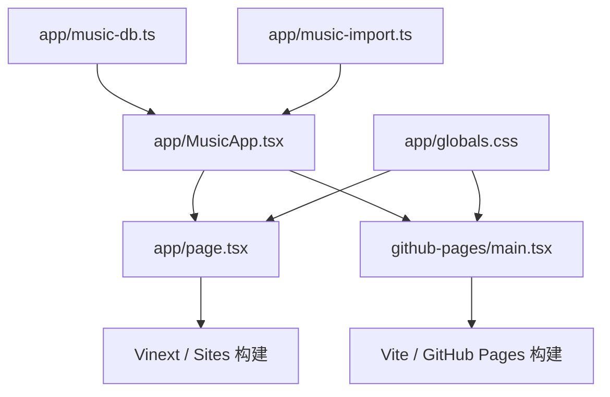

# RoadBeat 项目全景说明

> 最后整理：2026-08-02<br>
> 当前状态：可安装、可离线使用、已在 iPhone 与特斯拉蓝牙音响上完成实际播放验证<br>
> 文档目的：未来继续修改、排查问题或整体重构前，先通过本文件快速理解产品背景、业务规则、技术结构和发布方式。

## 1. 项目背景

RoadBeat 是一个只供个人使用的 iPhone 本地音乐播放器。

最初需求是：Mac 中保存着个人 MP3 等音乐文件，希望开车时在 iPhone 上操作音乐，并通过特斯拉蓝牙使用车载音响播放。因为发布原生 iOS App 需要 Apple 开发者账号、签名、审核和安装流程，而这个产品不面向公众运营，所以最终采用了更轻量的方案：

- 程序本体是静态网页，可托管在 GitHub Pages。
- 在 iPhone Safari 中“添加到主屏幕”后，以 PWA 形式运行，视觉与操作接近独立 App。
- 音乐文件不上传 GitHub，也不进入项目代码，而是导入后保存在当前 iPhone 的浏览器数据库中。
- iPhone 与特斯拉通过普通蓝牙媒体连接，RoadBeat 输出的系统音频由车载音响播放。
- Mac 到 iPhone 的文件传输通过 Mac 的“文件共享”（SMB），iPhone 在“文件”App 中挂载后由 RoadBeat 直接选取；早期使用的 VLC Wi-Fi 中转仍然可用，但不再是推荐路径。

RoadBeat 的核心定位不是在线音乐平台，而是“私人、离线、本机、车载友好”的音乐工具。

## 2. 产品边界

### 2.1 已实现

- iPhone 主屏幕 PWA 安装与独立窗口运行。
- 批量选择并导入本地音乐文件。
- 支持 MP3、M4A、AAC、WAV、AIFF、CAF，以及只播放音轨的 MP4。
- 读取歌曲标题、歌手、专辑与内嵌封面。
- 将音乐完整复制到 RoadBeat 自己的本地数据库。
- 搜索歌曲、按导入时间排序、按歌曲名称排序。
- 创建、重命名、删除自定义歌曲列表。
- 单曲分组与批量分组。
- 每首歌曲只能属于一个自定义列表。
- 播放、暂停、上一首、下一首、进度跳转、随机播放、单曲循环和列表循环。
- 随机播放走一轮完整洗牌顺序，一轮之内每首只出现一次；“上一首”回到真正播过的上一首。
- 电话、Siri 等系统中断结束后自动续播（用户自己按的暂停不会被续播）。
- 预生成下一首的播放地址，切歌无停顿。
- 搜索跨全部歌曲，不受当前列表限制。
- 导出/恢复歌曲列表配置（只含分组，不含音乐）。
- 简化的驾驶模式，并可选择要播放的歌曲列表。
- 锁屏、耳机和车载媒体按钮控制。
- 深色夜间主题与高对比浅色日间主题。
- 记住上次播放歌曲、播放进度和主题。
- 显示本机存储占用与常驻存储（persistent storage）状态。
- PWA 离线启动和旧缓存自动更新。
- iPhone 安全区、不同屏幕高度和底部系统区域适配。
- 卡通汽车音乐图标与社交分享图。

### 2.2 明确不做

以下功能在需求中被明确排除，后续不要在没有重新确认产品方向的情况下加入：

- 登录与账号体系。
- 云同步。
- 歌词。
- 在线音乐搜索。
- 多设备同步。

项目也没有服务器端音乐库、付费系统、推荐算法或版权音乐分发能力。

## 3. 最终使用流程


推荐操作步骤（首次只需做一次第 1、2 步）：

1. Mac：系统设置 → 通用 → 共享 → 打开“文件共享”，把音乐文件夹加进共享列表；记下同一页面显示的局域网地址或 IP。
2. iPhone：文件 App → 浏览 → 右上角 `⋯` → 连接服务器 → 输入 `smb://<Mac 的 IP>`，用 Mac 账户登录。之后这个 Mac 会常驻在文件 App 的“共享”里。
3. 在 iPhone 主屏幕打开 RoadBeat。
4. 点击“选取文件”，iOS 直接进入文件浏览器。
5. 选择“共享 → 你的 Mac → 音乐文件夹”。
6. 一次选择一首或多首歌曲并完成导入。
7. 确认歌曲已经出现在 RoadBeat 中，并实际播放一次。
8. 在特斯拉“控制 → 蓝牙”中连接该 iPhone，并把媒体源切换到“手机”。

这条路径不再需要 VLC 中转，Mac 上新增的歌曲下次打开文件 App 就能直接看到。要求 Mac 与 iPhone 在同一 Wi-Fi 且 Mac 处于唤醒状态。若不方便开局域网共享，也可以退回到 iCloud Drive 文件夹（把音乐放进 iCloud Drive，第 5 步改选 iCloud Drive）或原来的 VLC 流程。

## 4. 导入与本地存储机制

### 4.1 导入不是引用文件，而是复制文件

导入成功时，`app/music-import.ts` 会把选中的 `File` 转换为完整 `Blob`，然后由 `app/music-db.ts` 写入 IndexedDB。

因此：

- RoadBeat 不依赖 VLC 中的原始文件路径。
- 确认 RoadBeat 能正常播放后，可以删除 VLC 中的对应副本。
- 删除 VLC App 不会主动删除 RoadBeat 已经复制完成的歌曲。

但 RoadBeat 中的音乐仍然属于浏览器本地数据。以下操作可能删除它：

- 删除主屏幕上的 RoadBeat，并同时清理对应网站数据。
- 在 Safari 设置中清理该站点的数据。
- 系统在存储压力下回收网站数据。
- 更换域名后访问新的站点地址；不同域名拥有不同的本地数据库。

所以 Mac 上的原始音乐仍应保留备份，RoadBeat 不应被视为唯一存档位置。

### 4.2 iOS 文件菜单与两个导入入口

iOS 只有在 `accept` 允许图片或视频类型时，才会在文件输入上插入“照片图库”和“拍摄”这两个系统项。因此导入入口被拆成两个：

| 入口 | `accept` 常量 | iOS 行为 |
| --- | --- | --- |
| 主按钮“选取文件” | `AUDIO_ONLY_ACCEPT` | 只含音频类型，直接进入文件浏览器 |
| 次级入口“改为选取 MP4，只导入音轨” | `SUPPORTED_MEDIA_ACCEPT` | 含 `video/mp4`，会出现照片图库/拍摄系统项 |

两个入口共用同一个 `handleFiles`，导入逻辑没有分叉。日常导入因此少一步点击；只有需要 MP4 音轨时才会遇到系统菜单。这两项系统项本身仍然无法由网页删除。

### 4.3 支持格式与编码差异

文件扩展名白名单位于 `app/music-import.ts`：

| 扩展名 | 保存时使用的 MIME | 说明 |
| --- | --- | --- |
| `.mp3` | `audio/mpeg` | 首选格式，兼容性最好 |
| `.m4a` | `audio/mp4` | 常见 AAC 音频容器 |
| `.aac` | `audio/aac` | 编码必须被当前 iPhone 支持 |
| `.wav` | `audio/wav` | 文件通常较大 |
| `.aif` / `.aiff` | `audio/aiff` | AIFF 音频 |
| `.caf` | `audio/x-caf` | Apple Core Audio 格式 |
| `.mp4` | `video/mp4` | 不显示视频，只播放其中的音轨 |

“扩展名受支持”不等于“内部编码一定受支持”。例如部分 AAC 并非 AAC-LC/HE-AAC，部分 MP4 没有兼容音轨，此时 iPhone 仍可能无法播放。程序会给出针对 AAC 或 MP4 的错误提示。

### 4.4 重复歌曲识别

导入时按两级查重：

1. **快速指纹**（`fingerprint`）：`文件名 + 文件大小 + 文件最后修改时间`。零成本，命中就直接跳过。
2. **内容指纹**（`contentKey`）：对 `文件大小 + 前 512 KB + 后 512 KB` 做 SHA-256。同一首歌换个传输方式（VLC / SMB / iCloud Drive）后文件名和修改时间都会变，只有内容指纹能认出来。

数据库版本 3 之前导入的歌曲没有 `contentKey`，启动后由 `backfillContentKeys()` 在后台分批补算（每批 8 首），补完之前只有快速指纹生效。IndexedDB 会跳过索引值为 `undefined` 的记录，所以补算期间 `by-content` 索引仍然有效。

## 5. 歌曲列表业务规则

RoadBeat 的“总列表”实际代表“尚未分组的歌曲”，不是永远包含所有歌曲的全集视图。

核心规则：

1. 新导入歌曲首先出现在总列表。
2. 把歌曲移动到自定义列表后，它会从总列表消失。
3. 同一首歌曲最多属于一个自定义列表。
4. 把歌曲从自定义列表移动回总列表，相当于取消分组。
5. 删除歌曲列表只删除列表本身，歌曲会重新回到总列表。
6. 删除歌曲会同时从数据库和所有列表引用中移除。
7. 批量分组与单曲分组使用同一套排他性移动逻辑。

应用启动时，`normalizeExclusiveSongLists()` 会清理失效歌曲 ID 和历史重复归属，保证排他规则持续成立。

## 6. 播放与特斯拉蓝牙

RoadBeat 使用浏览器原生 `<audio>` 播放本地 Blob URL。蓝牙设备选择由 iOS 负责，网页无法自己扫描、配对或强制连接特斯拉。

正确连接关系是：

```text
RoadBeat → iPhone 系统媒体音频 → iPhone 蓝牙 → 特斯拉“手机”媒体源
```

注意：特斯拉手机钥匙连接不等于媒体蓝牙连接。手机可以正常解锁车辆，但媒体源仍可能没有连接。

程序通过 Media Session API 提供：

- 播放与暂停。
- 上一首与下一首。
- 前进、后退与指定进度。
- 当前歌曲标题、歌手、专辑和封面。
- 播放状态与进度。

这些信息可供 iPhone 锁屏、耳机按钮、方向盘或特斯拉车机媒体控制使用。具体显示能力仍取决于当前 iOS 和特斯拉系统版本。

## 7. 页面与交互结构

应用只有一个页面容器，通过内部状态切换三个主视图。

顶栏在音乐库和设置页承担页面标题：左侧是品牌图标 + 当前页名 + 一行摘要（首数/占用，或设置页副标题），右侧是这一页真正的动作（音乐库是“选取文件”，设置是仅存本机状态）。以前顶栏之外还有一整块大标题区，在手机上占掉近三分之一屏幕才看到第一首歌，已经合并掉。

### 7.1 音乐库

- 选取文件与批量导入。
- 自定义歌曲列表标签。
- 搜索。
- 导入时间和歌曲名称排序。
- 单曲播放。
- 单曲删除。
- 单曲分组和批量分组。
- 列表重命名与删除。

### 7.2 驾驶

- 选择播放列表。
- 大尺寸封面与歌曲信息。
- 大尺寸上一首、播放/暂停、下一首。
- 播放进度。
- 蓝牙媒体提示。
- 页面有意减少文字和次要按钮，降低驾驶时的操作复杂度。

### 7.3 设置

- 深色/浅色主题切换。
- 本机存储用量。
- 特斯拉车载音响说明与播放测试。
- 纯本地数据提醒。
- 清空本机音乐库。

### 7.4 全局播放器

- 非驾驶页面底部显示迷你播放器。
- 点击迷你播放器打开完整播放页。
- 完整播放页提供进度、随机、循环、上一首、下一首与输出提示。

## 8. 主题与 iPhone 全屏适配

样式集中在 `app/globals.css`。

主题策略：

- 深色主题用于夜间，默认背景接近黑色，强调色为橙红。
- 浅色主题用于白天，使用暖白背景与深色正文，保证强光下的对比度。
- 主题写入 `localStorage` 的 `roadbeat:theme`，下次启动自动恢复。
- 浅色模式使用浅色状态栏，深色模式使用 `black-translucent` 状态栏。

全屏策略：

- `viewport-fit=cover` 开启 iPhone 安全区信息。
- 顶栏使用 `safe-area-inset-top`。
- 底栏使用 `safe-area-inset-bottom`。
- 移动端容器固定在 iOS 实际可交互视口内，不再根据某一型号硬编码整机高度。
- iOS 保留的底部系统区域与导航栏使用相同颜色，视觉上连续铺满，但不把按钮放进不可点击区域。
- `--nav-height` 在移动端为 `58px`（桌面仍为 `78px`）。改动它会同时影响迷你播放器位置和各视图的底部内边距，它们都从同一组变量推导。
- 底部预留量 `--safe-bottom` 不再直接取 `env(safe-area-inset-bottom)`，而是取 `hooks/useAppShell.ts` 运行时算出的 `--roadbeat-safe-bottom`：它等于「安全区底部 − 已经落在视口之外的屏幕高度」。原因见下一节。

### 8.1 iPhone 底部空白：实测结论

这个问题被反复"修好"过至少四次（2026-07-31、08-02 两次、09-04），每次都是从截图估算像素后改 CSS，其中一次把底栏文字弄成被 iOS 裁切。2026-09-04 在设备上实测后，结论如下。

测试机：iPhone Air，iOS 26（UA 中的 `OS 18_7` 是 Apple 冻结的标记），主屏幕独立窗口。

```text
screen.height   912      屏幕逻辑高度
window.inner    844      页面拿到的视口高度
outerHeight     912      窗口本身是满屏的
window.screenY  0        视口从屏幕最顶端开始
safe-area 上/下  68 / 34
顶栏 rect       top0 高119 padding-top 68px
底栏 rect       top752 高92 bottom844
```

要点：

1. **底栏没有错位。** 它的 `bottom` 等于 844，正好是视口底边，CSS 已经把它贴到页面能到的最底部。
2. **短的是视口，不是页面。** iOS 只给了这个 web app 844 的高度，屏幕剩下的 68 点系统不交出来。这解释了为什么 2026-08-02 强行把高度撑到 912 会被裁切——那块区域不属于网页。
3. **视口锚在屏幕顶端。** `screenY` 为 0，且顶栏 `padding-top` 解析成 68px 后标题正好落在灵动岛下方；所以缺的 68 点在**底部**。
4. **因此 Home 指示条不在视口里。** 它位于那块够不到的 68 点中。页面再按 `env(safe-area-inset-bottom)` 预留 34px，是为一个根本不存在的遮挡把按钮往上顶——这 34px 已经由上面的运行时计算收回。
5. **`black-translucent` 不是原因。** 曾怀疑浅色主题用 `default` 导致窗口被压缩，在设备上强制 `black-translucent` 重启后实测，缺口仍为 68，假设被证伪。`viewport-fit=cover` 也确认在线上 HTML 中存在。

剩下的 68 点当前**没有解决**，属于已知限制。未来若要再查，请先测量再动手，不要从截图估算：

- 未验证的下一个假设：iOS 在「添加到主屏幕」那一刻快照了当时的配置来决定窗口几何，而这个图标是 2026-07-29 添加的，之后所有 meta 改动对已安装实例可能都不生效。零风险的验证方法是从 Safari **再添加一个图标**（原图标不动），在新实例里读取同样的数值。
- 另一个待测数据是 `100lvh` 的解析值：若它大于 `innerHeight`，说明存在更高的视口可以使用。
- 缺口区域的颜色由 `theme-color` meta 决定，目前与底栏背景同色（浅色 `#faf7f1`、深色 `#0b0c10`），所以视觉上是连续的一条，不会出现异色断层。
- 桌面端保留最大宽度和圆角手机外观，移动端使用全宽布局。

排版下限：界面上任何标签不小于 11px。9–10px 的说明文字在手机上已经偏小，在行驶中的车里基本不可读。

以后适配新 iPhone 时，应优先使用安全区和动态视口单位，不要重新加入基于某一型号宽高比例的硬编码。

## 9. 数据结构

本地数据库名称：`roadbeat-library`<br>
当前数据库版本：`3`

### 9.1 TrackRecord

| 字段 | 含义 |
| --- | --- |
| `id` | 随机 UUID，歌曲主键 |
| `fingerprint` | 文件名、大小和修改时间组成的快速查重指纹 |
| `contentKey` | 音频内容的 SHA-256 采样哈希；版本 3 以前的记录为空，启动后补算 |
| `fileName` | 原始文件名 |
| `title` | 标签标题或清理扩展名后的文件名 |
| `artist` | 标签歌手，缺失时为“未知歌手” |
| `album` | 标签专辑，缺失时为“本地音乐” |
| `duration` | 浏览器读取到的秒数 |
| `size` | 文件字节数 |
| `mime` | 归一化后的媒体 MIME |
| `audio` | 完整音乐 Blob |
| `artwork` | 可选内嵌封面 Blob |
| `addedAt` | 导入时间 |
| `lastModified` | 原文件最后修改时间 |

索引：

- `by-added`：按导入时间。
- `by-fingerprint`：唯一索引，用于阻止重复导入。
- `by-content`：**非唯一**索引，用于内容级查重。之所以不设唯一，是因为补算过程中可能发现历史遗留的同内容记录，唯一索引会让写入直接失败。

### 9.2 SongListRecord

| 字段 | 含义 |
| --- | --- |
| `id` | 随机 UUID，列表主键 |
| `name` | 自定义列表名称 |
| `trackIds` | 属于该列表的歌曲 ID 数组 |
| `createdAt` | 创建时间 |
| `updatedAt` | 最后更新时间 |

索引：`by-created`。

### 9.3 localStorage

| Key | 内容 |
| --- | --- |
| `roadbeat:last-playback` | 上次播放歌曲 ID 与播放秒数 |
| `roadbeat:theme` | `dark` 或 `light` |

音乐 Blob 和歌曲列表不存放在 localStorage，而是在 IndexedDB 中。

### 9.4 修改数据结构时的要求

未来新增、删除或改变 IndexedDB 字段时：

1. 提升 `openDB()` 中的数据库版本号。
2. 在 `upgrade()` 中按 `oldVersion` 编写向前迁移。
3. 不要直接删除旧对象仓库，否则用户已导入的音乐会丢失。
4. 使用已有数据实际验证升级路径，而不只验证全新安装。

## 10. 离线机制

`public/sw.js` 是 Service Worker，缓存名称在构建时生成：

```text
roadbeat-shell-<产物哈希>
```

源文件里写的是占位符 `roadbeat-shell-__ROADBEAT_BUILD__`，`build/sw-version-plugin.ts` 在两个构建里都会把它替换成产物文件名列表的哈希。因为 Vite 的资源文件名本身带内容哈希，所以缓存名"客户端代码变了才变"，不需要再手工递增，也不会因为忘记递增而让已安装用户停在旧版。

策略：

- 安装阶段预缓存首页、manifest 和主屏幕图标。
- 页面导航优先请求网络，失败时回退到缓存首页。
- 同源静态资源首次请求后写入缓存，再次访问优先使用缓存。
- 新 Service Worker 激活时删除旧 `roadbeat-*` 缓存。
- `skipWaiting()` 和 `clients.claim()` 让新版尽快接管。

音乐文件不进入 Service Worker Cache，而是独立保存在 IndexedDB。

不要再手工改 `CACHE_NAME`：改了反而会破坏占位符替换。

## 11. 技术架构

### 11.1 主要技术

- React 19：界面和状态。
- TypeScript：类型检查。
- Vite：GitHub Pages 静态构建。
- Vinext / Next App Router 兼容层：Sites 构建。
- IndexedDB + `idb`：音乐和列表持久化。
- `jsmediatags`：读取音频标签与封面。
- Lucide React：界面图标。
- CSS + Tailwind CSS 入口：完整视觉与响应式布局。
- Media Session API：系统和车载媒体控制。
- Service Worker + Web App Manifest：安装与离线能力。

### 11.2 双入口结构

同一套 RoadBeat 核心代码被两个构建入口复用：



修改核心功能时通常只改 `app/`，两个发布版本会同时获得更新。不要在两个入口分别复制业务逻辑。

## 12. 必要文件说明

### 12.1 核心应用

| 路径 | 职责 |
| --- | --- |
| `app/MusicApp.tsx` | 主应用：视图状态、歌曲列表管理、导入流程、备份导出恢复、界面组装 |
| `app/hooks/useAudioPlayer.ts` | 播放核心：当前歌曲、Blob URL、预加载、播放意图与中断续播、随机与循环 |
| `app/hooks/useMediaSession.ts` | 锁屏 / 耳机 / 方向盘 / 车机的媒体控制与元信息 |
| `app/hooks/useTheme.ts` | 深浅主题读取、持久化、状态栏与 theme-color 同步 |
| `app/hooks/useAppShell.ts` | 视口高度、独立窗口判定、在线状态、Service Worker 注册 |
| `app/lib/song-lists.ts` | 「一首歌最多属于一个列表」的唯一实现（排他移动 + 启动清理） |
| `app/lib/library.ts` | 内容指纹后台补算、上次播放位置读取 |
| `app/lib/format.ts` | 时间、体积、导入时间格式化与封面色相 |
| `app/lib/types.ts` | 共享类型与 localStorage / 总列表常量 |
| `app/components/CoverArt.tsx` | 封面（内嵌图或按标题生成的色块）与 Blob URL 生命周期 |
| `app/components/IconButton.tsx` | 统一的图标按钮 |
| `app/music-db.ts` | IndexedDB 数据结构与增删改查 |
| `app/music-import.ts` | 格式判断、标签解析、时长读取、内容指纹、Blob 生成 |
| `app/globals.css` | 深浅主题、组件样式、iPhone 安全区与响应式布局 |
| `app/page.tsx` | Sites/Vinext 页面入口 |
| `app/layout.tsx` | HTML 元信息、PWA 图标、viewport 和启动主题 |

### 12.2 GitHub Pages

| 路径 | 职责 |
| --- | --- |
| `github-pages/index.html` | 静态 HTML、PWA meta、启动主题脚本 |
| `github-pages/main.tsx` | React 静态入口 |
| `vite.pages.config.ts` | GitHub Pages 构建配置，使用相对路径 |
| `build/deploy-pages.sh` | `npm run deploy`：构建并推送到 `gh-pages` |
| `build/github-workflows/deploy-pages.yml` | 待启用的自动部署工作流（见同目录 README） |

### 12.3 Sites / Cloudflare 兼容构建

| 路径 | 职责 |
| --- | --- |
| `.openai/hosting.json` | Sites 项目标识和逻辑资源绑定 |
| `vite.config.ts` | Vinext 与 Cloudflare 构建配置 |
| `worker/index.ts` | Sites Worker 请求入口 |
| `build/sites-vite-plugin.ts` | 把 Sites 元数据复制进部署产物 |
| `build/sw-version-plugin.ts` | 构建时把 `public/sw.js` 的缓存名替换成产物哈希 |

`vite.config.ts` 以可选方式读取 `.openai/hosting.json`：文件不存在时构建照常进行，只是不绑定 D1 / R2。原来这里是静态 `import`，一旦该文件缺失整个 `npm run build` 就会失败。

### 12.4 PWA 静态资产

| 路径 | 职责 |
| --- | --- |
| `public/manifest.webmanifest` | 安装名称、图标、主题色、竖屏模式 |
| `public/sw.js` | 离线缓存与升级 |
| `public/apple-touch-icon.png` | iPhone 主屏幕图标 |
| `public/icon-192.png` | PWA 图标 |
| `public/icon-512.png` | PWA 大图标和 maskable 图标 |
| `public/og.png` | 链接分享预览图 |
| `public/.nojekyll` | 防止 GitHub Pages 使用 Jekyll 处理静态资源 |

> 注意：`.git`、`.gitignore`、`.github/` 和 `.openai/` 都是以点开头的隐藏目录，用 Finder 搬动项目文件夹时很容易漏掉。`.gitignore` 已重建，仓库也已重新连回 GitHub；部署工作流暂存在 `build/github-workflows/`。`.openai/hosting.json` 里的 Sites 项目 ID 无法凭空恢复，构建已改为在缺失时跳过 D1 / R2 绑定。

### 12.5 工程配置

| 路径 | 职责 |
| --- | --- |
| `package.json` | 依赖、Node 版本和命令 |
| `package-lock.json` | 锁定可复现依赖版本 |
| `tsconfig.json` | TypeScript 配置 |
| `postcss.config.mjs` | Tailwind CSS 的 PostCSS 配置 |
| `eslint.config.mjs` | 代码检查规则 |
| `types/jsmediatags-browser.d.ts` | 浏览器版 jsmediatags 模块声明 |
| `.gitignore` | 忽略依赖、构建产物、缓存、环境变量和本地工作文件 |
| `README.md` | 本文档，项目唯一说明入口 |

## 13. 本地开发

### 13.1 环境

- Node.js `>= 22.13.0`
- npm

首次取得项目或清理依赖后：

```bash
npm ci
```

启动开发环境：

```bash
npm run dev
```

代码检查：

```bash
npm run lint
```

Sites/Vinext 构建：

```bash
npm run build
```

GitHub Pages 构建：

```bash
npm run build:pages
```

构建并发布到线上：

```bash
npm run deploy
```

生成目录：

- `dist/`：Sites/Vinext 构建产物。
- `dist-pages/`：GitHub Pages 静态产物。

这两个目录都可以重新生成，不属于源代码，不应提交。

按当前整理要求，自动测试文件已经移除。未来修改至少应同时执行 `npm run lint`、`npx tsc --noEmit`、`npm run build` 和 `npm run build:pages`，再按第 15 节做手动验证。

## 14. 发布方式

### 14.1 GitHub Pages

公共使用地址：

<https://epeople438.github.io/roadbeat-private-player/>

仓库有两个分支，职责不同：

| 分支 | 内容 |
| --- | --- |
| `main` | 源代码，唯一的事实来源 |
| `gh-pages` | `dist-pages/` 的构建产物，GitHub Pages 直接从这里的根目录提供服务 |

Pages 当前是 **legacy 模式**（source: `gh-pages` 分支 `/`），不是 GitHub Actions 模式。发布：

```bash
npm run deploy
```

该命令（`build/deploy-pages.sh`）会构建、把产物覆盖进一个 `gh-pages` 的临时 worktree、提交并推送。源代码本身的改动照常 `git push origin main`，那一步不会触发部署。

当前构建使用 `base: "./"`，确保它既能在仓库子路径运行，也能正确加载图标、Service Worker 和静态资源。

#### 尚未接通：Actions 自动部署

工作流文件已经写好，但暂存在 `build/github-workflows/deploy-pages.yml` 而不是 `.github/workflows/`：通过 OAuth 授权的 `gh` token 需要额外的 `workflow` 权限，才被允许写入后者。启用步骤见 `build/github-workflows/README.md`，一共四步（补权限、复制文件并推送、改 Pages Source、改默认分支）。

在此之前，`npm run deploy` 是唯一的发布方式。

### 14.2 Sites

Sites 版本地址：

<https://roadbeat-private-player.vj9527.chatgpt.site>

该版本复用相同应用代码，通过 Vinext 和 Cloudflare Worker 兼容构建发布。`.openai/hosting.json` 中的项目 ID 是部署标识，不要随意替换或为同一项目重复创建 Sites 项目。

## 15. 发布前手动验证清单

因为测试文件已按要求删除，下面的检查对后续修改尤其重要。

### 15.1 基础

- 页面可打开，没有白屏。
- 深色和浅色主题都可切换、刷新后可恢复。
- iPhone 主屏幕图标正确。
- 顶部状态栏和底部菜单没有被裁切。
- 底栏按钮贴在页面可用区域的最底部（iPhone Air 上其下方仍有约 68 点系统区域，见第 8.1 节，属已知限制）。
- “音乐库、驾驶、设置”图标和文字完整可见。

### 15.2 导入与存储

- 可从 iPhone 文件 App 选择 MP3。
- 可一次选择多首歌曲。
- 导入完成后刷新 App，歌曲仍存在。
- 删除 VLC 源文件后，RoadBeat 副本仍可播放。
- 重复导入同一文件会被跳过。
- AAC 和 MP4 不兼容时提示信息正确。

### 15.3 列表

- 可创建、重命名、删除列表。
- 搜索能找到已经分到自定义列表里的歌，点开后播放范围切到该列表。
- 设置页导出配置得到 JSON；清掉列表后恢复配置能还原分组。
- 单曲移动到列表后从总列表消失。
- 歌曲不会同时出现在两个自定义列表。
- 批量移动几十首歌曲有效。
- 删除列表后歌曲回到总列表。

### 15.4 播放

- 播放、暂停、上/下一首和进度条有效。
- 随机与循环模式有效；随机播放连点“下一首”，每一轮 N 次应覆盖列表里全部 N 首。
- 随机模式下“上一首”回到刚才那一首，而不是又随机跳。
- 切歌之间没有明显停顿。
- 接一通电话或唤起 Siri 后，挂断回到 App 能自动续播。
- 锁屏显示正确歌曲信息。
- 切换到后台后，系统允许时继续播放。
- 特斯拉蓝牙媒体源选择“手机”后能够播放。
- 车载上一首、下一首、播放和暂停控制有效。

### 15.5 离线与升级

- 在线打开一次后，断网仍可启动。
- 构建产物 `dist-pages/sw.js` 里的缓存名已随客户端改动变化。
- 若手机仍显示旧版，彻底划掉 RoadBeat 后重新打开。

## 16. 已完成的主要修改历程

| 时间 | 阶段 | 结果 |
| --- | --- | --- |
| 2026-07-29 | 第一版 | 建立本地音乐 PWA、IndexedDB、播放器和 GitHub Pages 静态版本 |
| 2026-07-29 | 产品收敛 | 移除登录/认证脚手架，简化为纯本地产品 |
| 2026-07-29 | 导入流程 | 从隔空投送思路转向 VLC Wi-Fi 共享与文件 App 导入 |
| 2026-07-31 | 车载优化 | 适配 iPhone 驾驶页面，补充特斯拉蓝牙提示和播放测试 |
| 2026-08-01 | 歌曲列表 | 增加自定义列表、排他归属、列表播放和 MP4 音轨 |
| 2026-08-01 | 批量与格式 | 增加 AAC 等格式、批量分组和列表选择 |
| 2026-08-01 | 视觉主题 | 增加可记忆的深色/浅色主题 |
| 2026-08-01 | 驾驶简化 | 减少驾驶模式控件，替换卡通汽车音乐图标 |
| 2026-08-02 | 音乐库管理 | 增加导入时间和歌曲名称排序，精简设置项 |
| 2026-08-02 | iPhone 底栏 | 撤销错误的固定机型高度方案，恢复完整底栏并统一系统区域颜色 |
| 2026-08-02 | 文件入口 | RoadBeat 内所有入口统一为“选取文件”，明确 iOS 系统菜单限制 |
| 2026-08-02 | 项目整理 | 建立本全景文档，移除测试、样本音乐、旧配置和可再生成文件 |
| 2026-09-04 | 底栏贴底 | 移动端改用纯 `safe-area-inset-bottom` 预留并缩小 `--nav-height`，消除底栏下方空白 |
| 2026-09-04 | 导入简化 | 拆分音频/MP4 两个 `accept`，主入口直接进文件浏览器；引导改为 Mac SMB 共享，去掉 VLC 中转 |
| 2026-09-04 | 存储保护 | 首次成功导入后请求 `navigator.storage.persist()`，并在设置页显示常驻存储状态 |
| 2026-09-04 | 工程修复 | 补回丢失的 `.gitignore` 与 Pages 工作流，`hosting.json` 改为可选读取，`npm run build` 恢复 |
| 2026-09-04 | 播放质量 | 随机播放改为整轮洗牌、预加载下一首、系统中断后自动续播 |
| 2026-09-04 | 查重升级 | 增加内容指纹与数据库版本 3，后台补算历史记录 |
| 2026-09-04 | 备份 | 歌曲列表配置的导出与恢复 |
| 2026-09-04 | 代码结构 | 播放、主题、外壳、Media Session 拆成 hook，列表排他规则拆成独立纯函数模块 |
| 2026-09-04 | 界面 | 顶栏与页面大标题合并、列表信息精简、驾驶页控件下沉放大、最小字号提到 11px |
| 2026-09-04 | 仓库 | 重建本地 Git，源代码首次推上 `main`；`npm run deploy` 一条命令发布 |
| 2026-09-04 | 底栏实测 | 在设备上测出视口比屏幕矮 68 点，收回被误留的 34px；剩余 68 点记为已知限制 |

## 17. 已知限制

1. PWA 不能注册成 iOS 原生文件打开目标，因此不会像 VLC 原生 App 那样稳定出现在所有“打开方式”列表中。
2. iOS 文件输入的“照片图库/录像”系统项无法由网页删除。
3. RoadBeat 无法自行配对蓝牙；必须在 iPhone/特斯拉系统中完成。
4. 手机钥匙连接与媒体蓝牙连接是两件事。
5. AAC、MP4 是否可播放取决于内部编码，不只取决于扩展名。
6. 浏览器本地存储不是永久备份，原始音乐应继续保存在 Mac。
7. 更换域名、协议或站点路径可能形成新的存储空间，旧域名音乐不会自动迁移。
8. PWA 的后台播放、锁屏显示和系统菜单表现可能随 iOS/WebKit 升级变化。
9. GitHub Pages 只能托管程序静态文件，不应上传私人音乐。
10. iPhone Air / iOS 26 上，主屏幕独立窗口的视口比屏幕矮 68 点，底部这条系统区域网页无法使用。详见第 8.1 节的实测数据与后续排查方向。
11. `.openai/hosting.json` 中的 Sites 项目 ID 已随隐藏目录一起丢失，无法恢复；Sites 版本若要继续更新，需要从 Sites 后台取回该 ID。

## 18. 重构进展与后续建议

### 18.1 已完成

第一到第三阶段已经做完，`app/MusicApp.tsx` 从 2100+ 行降到约 1800 行，播放逻辑不再散落在主组件里：

```text
app/
  components/
    CoverArt.tsx        封面与 Blob URL 生命周期
    IconButton.tsx      统一图标按钮
  hooks/
    useAudioPlayer.ts   播放核心（当前歌曲、Blob URL、预加载、随机、循环、中断续播）
    useMediaSession.ts  系统与车机媒体控制
    useTheme.ts         主题
    useAppShell.ts      视口、独立窗口、在线状态、SW 注册
  lib/
    song-lists.ts       列表排他规则（唯一实现）
    library.ts          内容指纹补算、上次播放位置
    format.ts           格式化
    types.ts            共享类型与常量
  music-db.ts
  music-import.ts
```

`song-lists.ts` 里的 `assignTracksExclusively()` 现在是单曲移动、批量移动、新建列表带歌三条路径共用的唯一实现；`normalizeExclusiveSongLists()` 负责启动清理。以前这套逻辑在 `persistTrackAssignments` 和 `createSongList` 里各写了一遍。

`MusicApp.tsx` 仍然承担：视图切换、歌曲列表的增删改名、导入流程、备份导出恢复，以及全部 JSX。

### 18.2 后续可做

按价值排序，都不是必须：

1. 把三个视图（library / drive / settings）各自拆成 `features/` 下的组件，`MusicApp.tsx` 只留状态编排。这一步收益主要是可读性，风险在于 props 会很多，可以考虑先引入一个 context。
2. 把歌曲列表的增删改名也收进一个 `useSongLists` hook，和 `song-lists.ts` 的纯函数配套。
3. 导入流程（进度、取消、错误汇总）拆成 `useImport`。

### 18.3 数据迁移与备份

歌曲列表配置的导出/恢复已经实现（设置页）。如果未来数据价值继续提高，还可以考虑：

- 导出包含音乐的完整备份包（体积很大，需要分卷或流式写入）。
- 更明确地展示常驻存储的授权状态与被回收风险（当前只在设置页显示一个状态条）。

这些都应保持“用户主动操作、本机优先”的产品原则。

## 19. 重构时必须保持的约束

无论改用状态管理库、拆分组件还是更换构建工具，以下行为不能无意改变：

1. 私人音乐不能进入 GitHub、Sites 或任何云端构建产物。
2. 导入完成后必须保存完整 Blob，而不是依赖临时文件 URL。
3. 同一歌曲最多属于一个自定义列表。
4. 总列表表示未分组歌曲。
5. 删除列表不删除歌曲。
6. 删除歌曲必须清理所有列表引用。
7. 数据库升级必须迁移旧数据。
8. 两个发布入口应复用同一核心代码。
9. 移动端底栏必须位于 iOS 可交互视口内；底部预留量走运行时测量，不要改回直接使用 `env(safe-area-inset-bottom)`，也不要用硬编码机型高度撑满屏幕（已失败两次，见第 8.1 节）。
10. Service Worker 缓存名由构建插件生成，不要改回手工版本号。
11. 歌曲的排他归属只能通过 `app/lib/song-lists.ts` 修改，不要在组件里再写一份。
12. 导入去重必须同时保留快速指纹和内容指纹两级判断。
13. 不得重新加入已明确排除的登录、云同步、歌词、在线搜索和多设备同步。

## 20. 常见问题排查

### 页面仍是旧版

1. 从多任务界面彻底划掉 RoadBeat。
2. 重新从主屏幕打开。
3. 仍无效时，用 Safari 在线打开一次公共地址，再关闭重开。
4. 检查 `public/sw.js` 是否已经提升缓存版本。

### RoadBeat 没有声音

1. 先确认歌曲在 iPhone 扬声器上能播放。
2. 确认不是 AAC/MP4 内部编码不兼容。
3. 在特斯拉蓝牙页面确认媒体连接的是当前 iPhone。
4. 把车机媒体源切换到“手机”。
5. 检查 iPhone 与车机音量。

### VLC 文件删除后歌曲消失

正常情况下不会发生。若消失，应检查：

- 导入是否真正完成。
- 删除前是否在 RoadBeat 内成功播放过。
- 是否同时清理了 Safari/RoadBeat 网站数据。
- 当前打开的是否仍是原来的站点域名。

### 新手机看不到旧音乐

这是预期行为。RoadBeat 没有多设备同步，IndexedDB 只属于原 iPhone 和原站点。需要从 Mac/VLC 重新导入。

## 21. 项目清洁规则

以下内容不属于源代码，应保持忽略或按需重新生成：

- `node_modules/`
- `dist/`
- `dist-pages/`
- `.vinext/`
- `.wrangler/`
- `.next/`
- `*.tsbuildinfo`
- `work/`
- `.DS_Store`
- 本地 `.env*`
- 任何 MP3、M4A、AAC、WAV、AIFF、CAF 或 MP4 私人媒体文件

仓库中不再保留测试目录和音乐样本。重新开发时用 `npm ci` 安装依赖，用构建命令重新生成产物。

---

未来把项目交给新的开发者或 Codex 时，建议第一句话直接写：

> 请先完整阅读 README.md，在不破坏其中“业务规则、数据结构、发布方式和重构约束”的前提下继续修改 RoadBeat。
